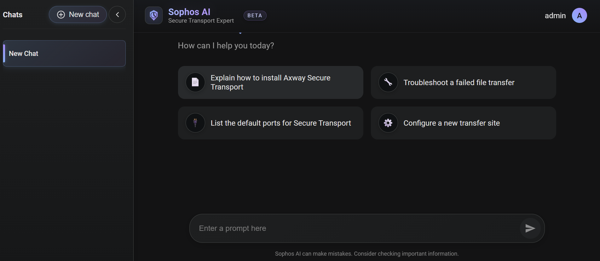

# Sophos AI – RAG Powered Assistant

## Overview

Sophos AI is a Retrieval-Augmented Generation (RAG) based intelligent assistant designed for Secure Transport knowledge retrieval and troubleshooting.

The platform combines:

* FastAPI backend
* React frontend
* Qdrant vector database
* Ollama hosted LLMs
* Dockerized deployment
* Automated CI/CD using GitHub Actions

---

## Architecture

```text
React Frontend
       |
       v
FastAPI Backend
       |
       +----> Ollama LLM
       |
       +----> Qdrant Vector DB
```

---

## Features

* RAG based intelligent querying
* Streaming AI responses
* Hybrid semantic search
* Cross-encoder reranking
* Dockerized deployment
* GitHub Actions based CI/CD
* Self-hosted runner deployment
* Persistent Qdrant storage
* Health checks for containers
* Environment driven configuration

---

## Tech Stack

### Backend

* FastAPI
* LangChain
* Transformers
* Qdrant
* Ollama
* SQLite

### Frontend

* React
* React Markdown
* Nginx

### DevOps

* Docker
* Docker Compose
* GitHub Actions

---

## Prerequisites

Install the following:

* Docker
* Docker Compose
* Git
* Ollama

Pull required model:

```bash
ollama pull qwen3:1.7b
```

---

## Environment Configuration

Create `.env` in project root:

```env
OLLAMA_BASE_URL=http://host.docker.internal:11434
OLLAMA_MODEL=qwen3:1.7b
REACT_APP_API_URL=http://localhost:8000
QDRANT_API_KEY=
TEAMS_WEBHOOK_URL=
```

---

## Run Application

### Start services

```bash
docker compose up -d --build
```

### Stop services

```bash
docker compose down
```

### View logs

```bash
docker compose logs -f
```

---

## Services

| Service  | Port  |
| -------- | ----- |
| Frontend | 3000  |
| Backend  | 8000  |
| Qdrant   | 6333  |
| Ollama   | 11434 |

---

## CI/CD Pipeline

GitHub Actions workflow automatically:

* Detects changed components
* Builds only required images
* Stops old containers
* Deploys updated containers
* Verifies backend health

Workflow file:

```text
.github/workflows/deploy.yml
```

Deployment runs on:

* master
* feature/dockerization

---

## Docker Containers

Check running containers:

```bash
docker ps
```

Expected containers:

* sophos-frontend
* sophos-backend
* sophos-qdrant

---

## Health Checks

### Backend

```bash
curl http://localhost:8000/
```

### Frontend

```bash
curl http://localhost:3000
```

---

## Useful Commands

### Rebuild backend

```bash
docker compose build backend
```

### Rebuild frontend

```bash
docker compose build frontend
```

### Restart services

```bash
docker compose restart
```

### Remove containers and volumes

```bash
docker compose down -v
```

---

## Project Structure

```text
Sophos_AI/
├── .github/workflows/
├── sophos_ai_backend/
├── sophos-ai-frontend/
├── docker-compose.yml
├── README.md
└── .env
```

---

## Application UI

Add your screenshot inside:

```text
images/ui.png
```

Then use:



---

## Future Improvements

* JWT authentication
* Kubernetes deployment
* Redis caching
* Monitoring with Prometheus/Grafana
* GPU inference support
* HTTPS reverse proxy

---

## Author

Aman Trivedi

